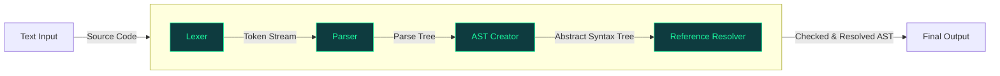

[](https://github.com/GeoWerkstatt/GeoW.Interlis.Tools/actions/workflows/ci.yml)

# geowerkstatt Interlis Tools

## GitHub NuGet Feed
| NuGet package |
|-|
| [Geowerkstatt.Interlis.Compiler](https://github.com/GeoWerkstatt/GeoW.Interlis.Tools/pkgs/nuget/Geowerkstatt.Interlis.Compiler) |
| [Geowerkstatt.Interlis.RepositoryCrawler](https://github.com/GeoWerkstatt/GeoW.Interlis.Tools/pkgs/nuget/Geowerkstatt.Interlis.RepositoryCrawler) |
| [Geowerkstatt.Interlis.XtfReader](https://github.com/GeoWerkstatt/GeoW.Interlis.Tools/pkgs/nuget/Geowerkstatt.Interlis.XtfReader) |

To authenticate to the geowerkstatt GitHub Packages registry you must use a [personal access token (classic)](https://docs.github.com/en/authentication/keeping-your-account-and-data-secure/managing-your-personal-access-tokens#creating-a-personal-access-token-classic) with at least `read:packages` scope to install packages associated with other private repositories.
Then create a _nuget.config_ file in your project directory specifying GitHub Packages as a source (see example below).
You must replace:

* `USERNAME` with the name of your personal account on GitHub.
* `PAT_CLASSIC` with your personal access token (classic).
```xml
<?xml version="1.0" encoding="utf-8"?>
<configuration>
  <packageSources>
    <clear />
    <add key="nuget.org" value="https://api.nuget.org/v3/index.json" protocolVersion="3" />
    <add key="github" value="https://nuget.pkg.github.com/GeoWerkstatt/index.json" protocolVersion="3" />
  </packageSources>
  <packageSourceCredentials>
    <github>
      <add key="Username" value="USERNAME" />
      <add key="ClearTextPassword" value="PAT_CLASSIC" />
    </github>
  </packageSourceCredentials>
</configuration>
```

The sample file above is a minimal configuration and also located in the root of this repository.

## Examples

### Compiler

The Compiler works in steps where the output of the previous step feeds into the next step:



For more details on how to use the Compiler see [InterlisReader](src/Geowerkstatt.Interlis.Compiler/InterlisReader.cs).

Compile an INTERLIS file:
```cs
var loggerFactory = LoggerFactory.Create(b => b.AddConsole());
var reader = new InterlisReader(loggerFactory);
var interlisFile = reader.ReadFile(new StreamReader(@"C:\path\to\model.ili"));
```

Compile a string containing the INTERLIS source:
```cs
var loggerFactory = LoggerFactory.Create(b => b.AddConsole());
var reader = new InterlisReader(loggerFactory);
var interlisFile = reader.ReadFile(new StringReader("INTERLIS 2.4;"));
```

Get intermediate output from the compiler:
```cs
var loggerFactory = LoggerFactory.Create(b => b.AddConsole());
var reader = new InterlisReader(loggerFactory);

// token stream from Lexer
var tokenStream = reader.RunLexer(new StringReader("INTERLIS 2.4;"));

// parse tree from parser
var interlisParser = reader.GetParser(tokenStream);
var parseTree = interlisParser.interlis();

// create abstract syntax tree
var astCreator = new Interlis24Visitor(loggerFactory, tokenStream);
var abstractSyntaxTree = (InterlisEnvironment)parseTree.Accept(astCreator);

// resolve references
var referenceResolver = new new Interlis24AstReferenceResolverVisitor(loggerFactory);
abstractSyntaxTree.Accept(referenceResolver);
```

### Repository Crawler

 - Configure the crawler in `appsettings.json`. For more options check out the [RepositoryCrawlerOptions](src/Geowerkstatt.Interlis.RepositoryCrawler/RepositoryCrawlerOptions.cs) class.
```json
{
  "RepositoryCrawler": {
    "RootRepositoryUri": "https://models.interlis.ch/",
  }
}
```
> [!NOTE]
> The default cache location ist at `%TEMP%/Geowerkstatt.Interlis/`

 - Use the [RepositorySearcher](src/Geowerkstatt.Interlis.RepositoryCrawler/RepositorySearcher.cs) to a model from an INTERLIS model repository.
```cs
var loggerFactory = LoggerFactory.Create(b => b.AddConsole());
var searcher = new RepositorySearcher(loggerFactory);
var model = await searcher.SearchModel("Units");
```

### XTF Reader

Read INTERLIS 2.4 transfer files with [XtfReader](src/Geowerkstatt.Interlis.XtfReader/XtfReader.cs).

```cs
var reader = new XtfReader();
var objects = reader.ReadXtf(new StreamReader(@"C:\path\to\data.xtf"));
```
