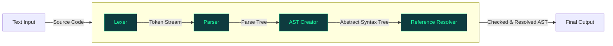

[](https://github.com/GeoWerkstatt/GeoW.Interlis.Tools/actions/workflows/ci.yml)

# geowerkstatt INTERLIS Tools

A collection of .NET libraries for working with [INTERLIS](https://www.interlis.ch/), the Swiss standard for geodata modelling and transfer. The libraries cover parsing model definitions, crawling model repositories, and reading transfer files. The Repository is subject to constant changes and does not provide any interface or functional and all functions may be subject to modification or removal without prior notice. The tools are intended as internal utilities for geowerkstatt projects, but are published as open source in case they may be useful to others working with INTERLIS in the .NET ecosystem. No guarantees are made regarding the stability of the API or the correctness of the implementations, but contributions and feedback are welcome. No support is provided for production use, but the tools may be used at your own risk.

## Components

| Package | Description |
|-|-|
| **Geowerkstatt.Interlis.Compiler** | Compiles INTERLIS 2.4 model definition files (`.ili`) into a typed Abstract Syntax Tree (AST) using an ANTLR4-based lexer/parser pipeline. |
| **Geowerkstatt.Interlis.RepositoryCrawler** | Crawls INTERLIS model repositories (IliSite09 / IliRepository format) recursively via HTTP or the local file system, and caches results in a local SQLite database. Exposes a high-level `RepositorySearcher` API for finding models by name. |
| **Geowerkstatt.Interlis.XtfReader** | Reads INTERLIS 2.4 transfer files (`.xtf`) and streams the contained objects as `InterlisObject` instances. Geometry types are represented using [NetTopologySuite](https://github.com/NetTopologySuite/NetTopologySuite). |
| **Geowerkstatt.Interlis.Common** | Shared utility extensions used internally by the other components. |

## Development Requirements

- [.NET 8.0 SDK](https://dotnet.microsoft.com/download/dotnet/8.0)

The ANTLR4 grammar files in `Geowerkstatt.Interlis.Compiler` are compiled automatically at build time via the `Antlr4BuildTasks` MSBuild package — no separate ANTLR installation is required.

## NuGet Packages

| Package |
|-|
| [Geowerkstatt.Interlis.Compiler](https://github.com/GeoWerkstatt/GeoW.Interlis.Tools/pkgs/nuget/Geowerkstatt.Interlis.Compiler) |
| [Geowerkstatt.Interlis.RepositoryCrawler](https://github.com/GeoWerkstatt/GeoW.Interlis.Tools/pkgs/nuget/Geowerkstatt.Interlis.RepositoryCrawler) |
| [Geowerkstatt.Interlis.XtfReader](https://github.com/GeoWerkstatt/GeoW.Interlis.Tools/pkgs/nuget/Geowerkstatt.Interlis.XtfReader) |

## Usage Examples

### Compiler

The Compiler works in steps where the output of the previous step feeds into the next step:



For more details on how to use the Compiler see [InterlisReader](src/Geowerkstatt.Interlis.Compiler/InterlisReader.cs).

Compile an INTERLIS file:
```cs
var loggerFactory = LoggerFactory.Create(b => b.AddConsole());
var reader = new InterlisReader(loggerFactory);
var interlisFile = reader.ReadFile(new StreamReader(@"C:\path\to\model.ili"));
```

Compile a string containing the INTERLIS source:
```cs
var loggerFactory = LoggerFactory.Create(b => b.AddConsole());
var reader = new InterlisReader(loggerFactory);
var interlisFile = reader.ReadFile(new StringReader("INTERLIS 2.4;"));
```

Get intermediate output from the compiler:
```cs
var loggerFactory = LoggerFactory.Create(b => b.AddConsole());
var reader = new InterlisReader(loggerFactory);

// token stream from Lexer
var tokenStream = reader.RunLexer(new StringReader("INTERLIS 2.4;"));

// parse tree from parser
var interlisParser = reader.GetParser(tokenStream);
var parseTree = interlisParser.interlis();

// create abstract syntax tree
var astCreator = new Interlis24Visitor(loggerFactory, tokenStream);
var abstractSyntaxTree = (InterlisEnvironment)parseTree.Accept(astCreator);

// resolve references
var referenceResolver = new Interlis24AstReferenceResolverVisitor(loggerFactory);
abstractSyntaxTree.Accept(referenceResolver);
```

### Repository Crawler

 - Configure the crawler in `appsettings.json`. For more options check out the [RepositoryCrawlerOptions](src/Geowerkstatt.Interlis.RepositoryCrawler/RepositoryCrawlerOptions.cs) class.
```json
{
  "RepositoryCrawler": {
    "RootRepositoryUri": "https://models.interlis.ch/",
  }
}
```
> [!NOTE]
> The default cache location ist at `%TEMP%/Geowerkstatt.Interlis/`

 - Use the [RepositorySearcher](src/Geowerkstatt.Interlis.RepositoryCrawler/RepositorySearcher.cs) to a model from an INTERLIS model repository.
```cs
var loggerFactory = LoggerFactory.Create(b => b.AddConsole());
var searcher = new RepositorySearcher(loggerFactory);
var model = await searcher.SearchModel("Units");
```

### XTF Reader

Read INTERLIS 2.4 transfer files with [XtfReader](src/Geowerkstatt.Interlis.XtfReader/XtfReader.cs).

```cs
var reader = new XtfReader();
var objects = reader.ReadXtf(new StreamReader(@"C:\path\to\data.xtf"));
```
